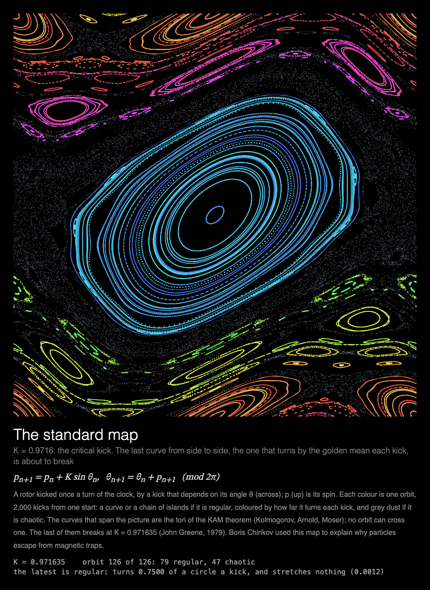

# MMM-StandardMap

A [MagicMirror²](https://magicmirror.builders/) module that plots Chirikov's standard map orbit by orbit: curves and islands of order, a sea of chaos between them, and the kick strength at which the last barrier breaks.



## What you see

**The standard map.** A rotor kicked once a period, by a kick that depends on the angle it is
at: its angle θ across the picture, its spin p up it. Three times a second a new orbit appears,
the dots of 2,000 kicks from one starting point. A regular orbit draws a closed curve or a chain
of islands, coloured by how far it turns each kick; a chaotic one scatters grey dust over the
region it can reach. After 42 s (126 orbits) the picture is done and the module rests.

Each showing takes the next of four kick strengths:

- **K = 0.5**: order almost everywhere; curves span the picture from side to side, and chaos is
  only a thin layer along the edges of the islands.
- **K = 0.9716**: the critical kick. The last curve from side to side, the one that turns by the
  golden mean each kick, is about to break.
- **K = 1.3**: every barrier broken; one chaotic orbit can wander from the bottom to the top.
- **K = 2.4**: a chaotic sea, with islands of order left in it.

Under the picture: the map, and what it shows. The readout gives K, how many orbits are regular
and how many chaotic, and for the latest one either how far it turns each kick or how fast
nearby starts part (its Lyapunov exponent).

Built for a **Raspberry Pi 3 without GPU acceleration**: everything is drawn by the CPU, each frame that changes the picture adds one whole orbit, only three times a second, and the module rests once the picture is done,
and the animation stops while the module is hidden (see [Performance](#performance)).

## Installation

```bash
cd ~/MagicMirror/modules
git clone https://github.com/charleswest775/MMM-StandardMap
```

No npm dependencies: there is nothing to install.

## Update

```bash
cd ~/MagicMirror/modules/MMM-StandardMap
git pull
```

## Configuration

```js
{
	module: "MMM-StandardMap",
	position: "middle_center",
	config: {
		cycleSeconds: 600,  // longer than the page is shown: one kick strength per showing
		width: 900,
		height: 900,
		fps: 20
	}
},
```

The kick strengths take turns **across showings**: each time the module is shown (or every
`cycleSeconds`, if it is shown for longer) it starts the next one. The picture is done in 42 s,
so a 45 s page shows all of it.

| Option | Default | Description |
|---|---|---|
| `standardMapK` | taking turns | Always this kick strength, e.g. `0.971635` |
| `cycleSeconds` | `60` | Start the next kick strength this often; the next one also starts each time the module is shown again |
| `width`, `height` | `900` | Canvas size in pixels. θ spans the width; p spans as many periods as the canvas is tall for its width, so a portrait canvas shows more than one |
| `fps` | `20` | Frame-rate cap |
| `showMath` | `true` | Equations and live numbers under the canvas |
| `turns` | `null` | Take turns with other modules on the same page, e.g. `{ of: 2, at: 1 }` (see [Taking turns](#taking-turns)) |
| `statsPanel` | `false` | A line under the math showing what the mirror spends: fps, CPU of Electron and the compositor, a bar per core, temperature. Sampled by the module's `node_helper` from `/proc`, only while the module is shown |
| `debugStats` | `false` | Show achieved fps and per-frame timings in the corner of the screen |

## Taking turns

With `turns: { of: n, at: k }`, modules on the same [MMM-pages](https://github.com/edward-shen/MMM-pages)
page each show on their own one in n showings of it: `at: 0` on the first showing and every
nth after it, `at: 1` on the second, and so on. A module that isn't on its turn takes no room on
the page and costs nothing: it hides its canvas and doesn't start. So one slot in the rotation
can hold several pages, without making the rotation longer. For example, order and chaos side by side twice over, in [MMM-ChaoticBilliards](https://github.com/charleswest775/MMM-ChaoticBilliards)' tables and in the standard map:

```js
{
	module: "MMM-ChaoticBilliards",
	classes: "page-chaos",
	position: "middle_center",
	config: { turns: { of: 2, at: 0 } }
},
{
	module: "MMM-StandardMap",
	classes: "page-chaos",
	position: "middle_center",
	config: { turns: { of: 2, at: 1 } }
},
{
	module: "MMM-pages",
	config: { modules: [["page-clock"], ["page-chaos"]], rotationTime: 45000 }
},
```

Without `turns` the module shows every time. It works just as well on a page of its own, or in
a normal region without MMM-pages, where it starts again every `cycleSeconds`.

## What's real

Chirikov's standard map (1969, 1979), exactly:

    p' = p + K sin θ,    θ' = θ + p'     (both mod 2π)

A rotor, free but for a kick once a period whose strength depends on the angle it's at. It keeps
area (its Jacobian's determinant is 1) like every Hamiltonian system, and is the simplest one in
which order and chaos live side by side. For small K most orbits lie on curves spanning θ (the
tori of the KAM theorem: Kolmogorov, Arnold, Moser), which no orbit can cross. The last of them,
turning by the golden mean each kick, breaks at K = 0.971635 (John Greene, 1979).

Each orbit is classed by its Lyapunov exponent, the average log of how much it stretches a small
displacement each kick, taken from the tangent map alongside it: above 0.02 a kick, chaotic. A
regular orbit is coloured by its rotation number, how far θ turns each kick on average (a little
varied, so the rings of one island can be told apart). The starting points are a Halton sequence
over the picture, shifted at random each showing.

The tests check that the map keeps area, that the fixed point (π, 0) is stable below K = 4 and
unstable above, that for strong kicks the Lyapunov exponent is Chirikov's ln(K/2) to 2%, that
below Greene's K an orbit from the chaotic layer at (0, 0) never gets a whole period away over
2 million kicks while at K = 1.2 it gets five, and that the page plots its orbits in 42 s and
rests.

## Performance

Not yet measured on the Pi. What it's designed to cost: an orbit's 2,000 dots are spread over
the whole canvas, so each change is a full-canvas repaint, but there are only three of them a
second (like three frames of a 20 fps full redraw, which costs ~150% of a core: so roughly a
quarter of a core), and none at all once the picture is done at 42 s. Computing an orbit takes
well under a millisecond.

Why it is drawn this way, from micro-benchmarks on the Pi:

- There is no GPU acceleration to be had (the Pi 3's GPU only does GLES 2.0; Chromium needs
  3.0), so every pixel is drawn by the CPU.
- Any frame that changes the canvas costs ~2% of a core per fps, before drawing anything.
- On top of that, cost grows with the **area that changes**: Chromium redraws the bounding box
  of everything touched in a frame.
- The frame loop sleeps with `setTimeout` until a frame is due, capped at `fps`. Once the picture
  is finished the module rests, and is only polled twice a second. While MagicMirror² fades the
  module out, nothing new is drawn; once it is hidden, the loop stops.

## Development

```bash
node --test                  # the map's checks (no dependencies)
python3 -m http.server       # then open http://localhost:8000/dev/preview.html
```

`dev/preview.html` runs the module outside MagicMirror², in a portrait 1200×1920 frame, with
hide/show buttons that follow MagicMirror²'s suspend/resume order. Query options override the
config, e.g. `?standardMapK=0.971635`, `?height=1400` (more than one period of p) or `?statsPanel=true`.

## License

MIT

Part of a family of MagicMirror² modules. Chaos, one simulation each:
[MMM-LorenzAttractor](https://github.com/charleswest775/MMM-LorenzAttractor),
[MMM-DoublePendulum](https://github.com/charleswest775/MMM-DoublePendulum),
[MMM-FractalBasins](https://github.com/charleswest775/MMM-FractalBasins),
[MMM-LogisticMap](https://github.com/charleswest775/MMM-LogisticMap),
[MMM-SymmetricIcons](https://github.com/charleswest775/MMM-SymmetricIcons),
[MMM-ThreeBody](https://github.com/charleswest775/MMM-ThreeBody),
[MMM-ChaoticBilliards](https://github.com/charleswest775/MMM-ChaoticBilliards),
[MMM-Rule30](https://github.com/charleswest775/MMM-Rule30),
[MMM-ChaoticWaterwheel](https://github.com/charleswest775/MMM-ChaoticWaterwheel) and
[MMM-Sandpile](https://github.com/charleswest775/MMM-Sandpile), or all eleven in
one module, [MMM-ChaosTheory](https://github.com/charleswest775/MMM-ChaosTheory).
And more pages of physics and mathematics:
[MMM-Atom](https://github.com/charleswest775/MMM-Atom),
[MMM-DoubleSlit](https://github.com/charleswest775/MMM-DoubleSlit),
[MMM-FractalZoom](https://github.com/charleswest775/MMM-FractalZoom),
[MMM-Chladni](https://github.com/charleswest775/MMM-Chladni),
[MMM-SacredGeometry](https://github.com/charleswest775/MMM-SacredGeometry),
[MMM-Tilings](https://github.com/charleswest775/MMM-Tilings),
[MMM-PlanetsDance](https://github.com/charleswest775/MMM-PlanetsDance),
[MMM-Harmonograph](https://github.com/charleswest775/MMM-Harmonograph),
[MMM-SnowCrystal](https://github.com/charleswest775/MMM-SnowCrystal) and
[MMM-NightSky](https://github.com/charleswest775/MMM-NightSky).
